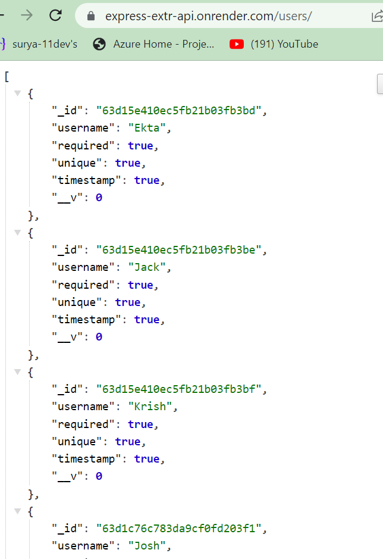
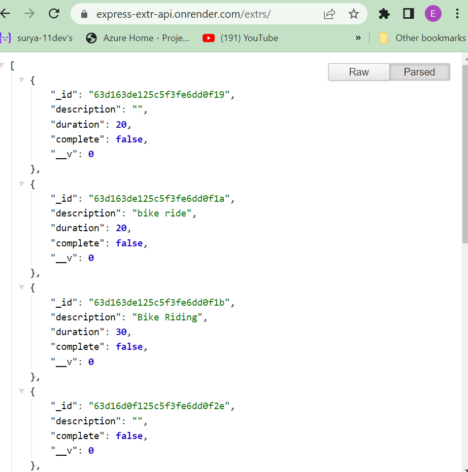

# EXERCISE-TRACKING SYSTEM

## About Project

This is a backend API for a MERN stack  exercise tracking system using Mongoose as Object Data Modeling library for MongoDB(as database) and Node.js

### Access on Render
[Live site](https://express-extr-api.onrender.com)

### Github Access
[Github](https://github.com/ektapass/exercise-track.git)

### Technologies Used
* Mongoose
* EXpress
* React
* Node

## Installing Dependencies

Run following commands in terminal:

* npm init -y
* npm i express mongoose dotenv cors
* npm i react-router-dom

## Screenshots

### Future plan to work on project:

To add more fields to model schema and work on parsing Date field.

### Acknowledgement

Thanks to my instructors and classmates .

&copy; Ekta Bharti 

